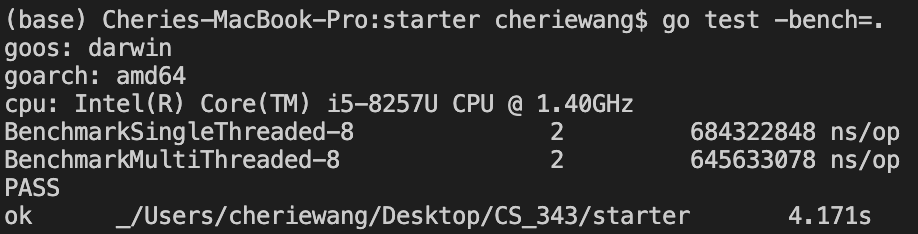
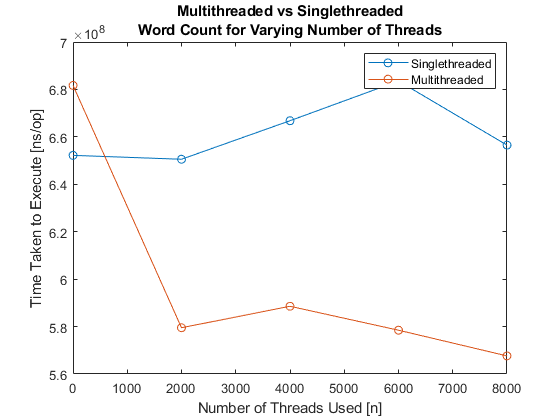

# Assignment 1
Cherie Wang, Miles Mezaki


## Designing The Algorithm


We discussed a few ideas, including using one thread for each file, cutting up files into smaller chunks like the MapReduce reading mentioned, or even attempting to emulate MapReduce itself. We ultimately decided that for our minimum viable product, we would attempt to implement multithreaded word count with one thread for each file specified in the input array. The issue with this approach, as we touched on in discussion, was that files of large size would still be processed significantly more slowly than files of smaller size since only one thread worked on the whole file. To surmount this hurdle, we pivoted our approach to take small chunks of file and have individual threads process those.


We also discussed how we would store and write data. We threw around the idea of storing each thread's output in a corresponding output file, then compiling all of the data into one file for testing. This, however, is imprudent. This works for an algorithm like MapReduce, wherein each Reducer receives all of any one key, but not for the solution that we were trying to implement in which different input files could have the same keys. We circumvented this concern by sharing storage between threads. This introduces a race condition if treated without care because multiple threads could be accessing the same map at the same time, so this design necessitated using mutual exclusion.


## Original Approach


Our original approach for multi-threading used one thread for each input file. This approach lacks efficiency because it's not guaranteed that files will be small.


```
n_files := len(files)
wg := sync.WaitGroup{}
// Creates a group of threads
wg.Add(n_files)
// Adds the number of threads
// (number of files) to the process
```


Each thread writes to the same map so that keys are not duplicated.


```
for i := 0; i < n_files; i++ {
    // Starts a new goroutine for every
    // file to count frequency of words
    // concurrently
    go func(file string) {
        m.Lock()
        // Ensures only one thread in
        // critical section during
        // mutual exclusion
       
        count_words(file, counter)
       
        m.Unlock()
        // Thread has exited
        // critical section
       
        wg.Done()  // Thread finishes its task
    }(files[i])
}
```
This code design made multithreading faster than single threaded approaches, but not by a meaningful amount of time.





## Revised Approach


Realizing that multithreading with our current methodology was not significantly better, we pivoted toward cutting larger files into small "thread-sized" strings. These strings would then be processed by each thread and the words would be counted up in a map in the threads' shared storage, much akin to our previous implementation. The difference this time is that we were guaranteeing small string sizes, meaning the amount of time each thread would take to finish was significantly shorter.
We implemented a function that would break the total string from all the files into smaller blocks. This method allows us to provide the number of blocks we want the string to split into and returns an array of the string blocks.

```
func cut_string_to_chunks(content string, n int) []string {
   lines_arr := strings.Split(content, "\n")


   size_of_chunk := len(lines_arr) / n


   str_arr := make([]string, n)


   for i := 0; i < n; i++ {
       start := i * size_of_chunk
       end := start + size_of_chunk
       if i == n-1 {
           // the last "chunk", include all remaining lines
           end = len(lines_arr)
       }
       str_arr[i] = strings.Join(lines_arr[start:end], "\n")
   }


   return str_arr
}
```

Thus, since the number of blocks corresponds to the number of threads the code is generating, we can modify that value freely. 


## Final Time Analysis


We analyzed how the processing time depended on the number of threads. Figure 1 displays our results.





*Figure 1: Time as a function of thread count*

There is an obvious downward trend in time consumption in our multithreaded word count, which is what we expect to see with increasing use of threads. Eventually the number of threads used had little impact on the amount of time taken, indicating that there was no pressing need to include more to perform the computation.

### *Admission of Error*
Note that there is uncertainty associated with the values presented in the visualization. The processor does not perform each computation in the same amount of time each time it is given the task, meaning the best we can do is provide averages. The data points given are the result of averaging the task performed by the CPU two times.

## Appendix

**Timed Data:**
| Number of Threads      | Singlethreaded (ns/op) | Multithreaded (ns/op)     |
| :---        |    :----:   |          ---: |
| 1      | 652194442 | 681684666   |
| 2000   | 650556324 | 579504741      |
| 4000      | 666806218 | 588560043   |
| 6000      | 683546176 | 578467450   |
| 8000     | 656516204 | 567629082   |